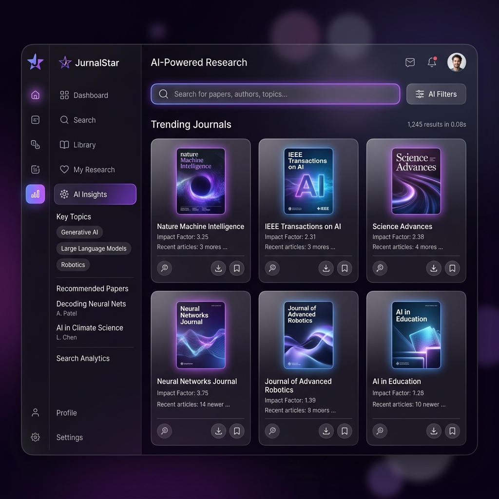
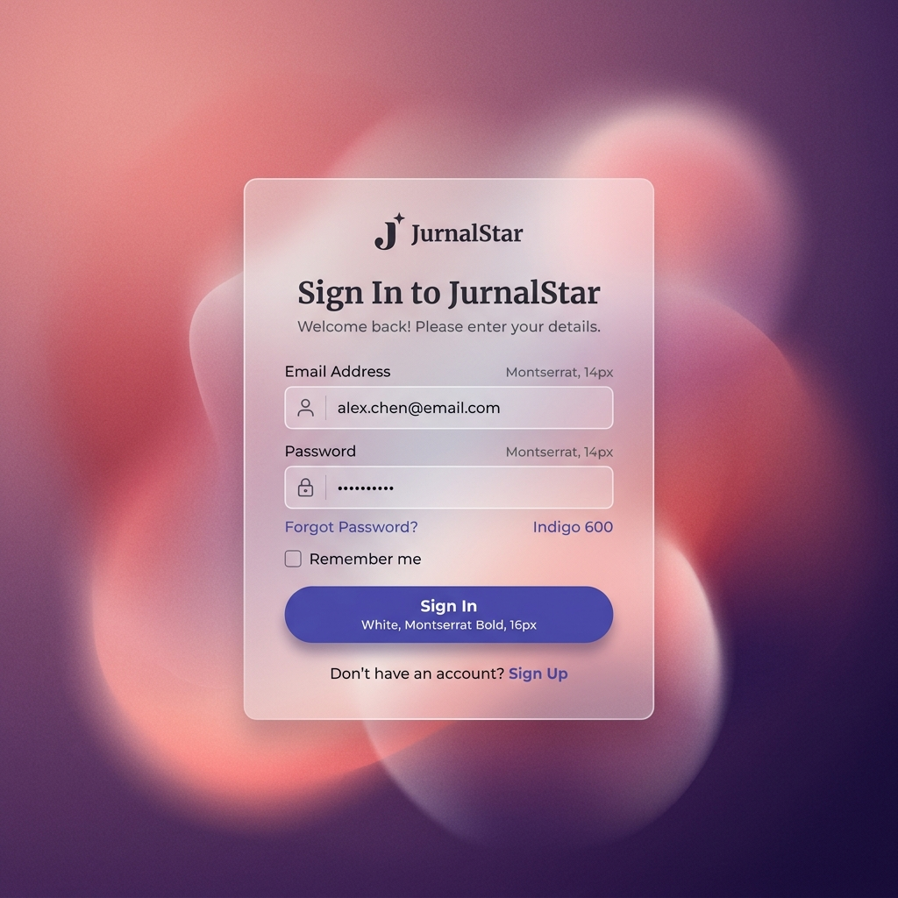

# 🌟 JurnalStar: The Future of AI Academic Research

JurnalStar adalah platform riset akademik generasi berikutnya yang ditenagai oleh kecerdasan buatan (AI) untuk membantu peneliti menemukan, menganalisis, dan merangkum jurnal ilmiah dengan kecepatan kilat.



## ✨ Fitur Utama

- **🚀 AI-Powered Search**: Pencarian cerdas melintasi jutaan database jurnal (OpenAlex, Semantic Scholar, ArXiv) dengan peringkat relevansi berbasis AI.
- **🔐 Secure Gatekeeper**: Sistem autentikasi tangguh dengan Next.js Middleware dan JWT untuk memastikan riset kamu tetap privat.
- **💎 Premium Glassmorphism UI**: Antarmuka modern yang responsif dengan dukungan penuh **Dark Mode** dan **Light Mode**.
- **📊 AI Research Analytics**: Dapatkan wawasan mendalam, ringkasan otomatis, dan deteksi "Research Gap" menggunakan model bahasa besar (LLM).
- **🗄️ Cloud Persistence**: Integrasi penuh dengan **Supabase PostgreSQL** untuk sinkronisasi bookmark dan riwayat riset secara real-time.



## 🛠️ Tech Stack

- **Framework**: Next.js 15 (App Router)
- **Database**: Supabase (PostgreSQL)
- **ORM**: Prisma
- **AI Engine**: Google Gemini API, Grok, & HuggingFace
- **Styling**: TailwindCSS & Framer Motion
- **Icons**: Lucide React

## 🚀 Instalasi Cepat

1. **Clone repositori**:
   ```bash
   git clone https://github.com/FikriBintangx/JURNALKU.git
   cd JURNALKU
   ```

2. **Install dependensi**:
   ```bash
   npm install
   ```

3. **Atur Environment Variables**:
   Buat file `.env.local` dan masukkan:
   ```env
   DATABASE_URL=your_supabase_url
   JWT_SECRET=your_secret
   GEMINI_API_KEY=your_key
   ```

4. **Sync Database**:
   ```bash
   npx prisma db push
   ```

5. **Jalankan Aplikasi**:
   ```bash
   npm run dev
   ```

---
Dibuat dengan ❤️ oleh **Fikri Bintang**
